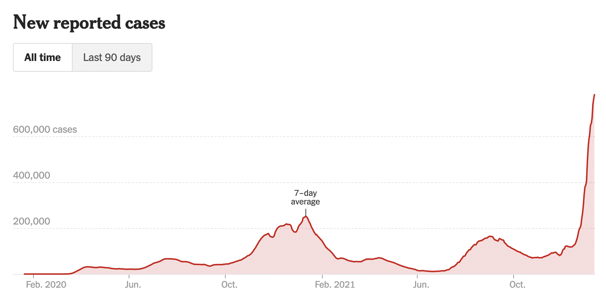
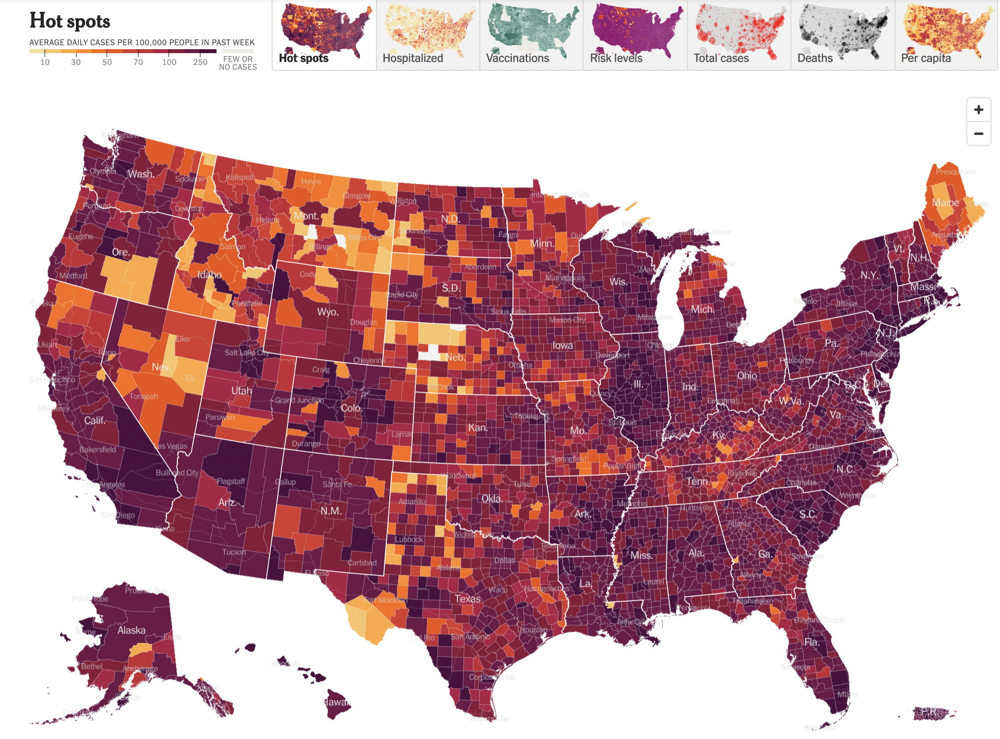
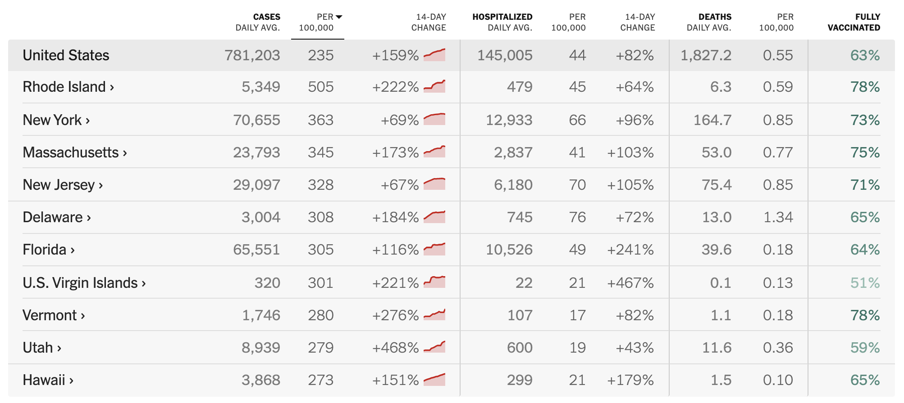

In May 2020, the Georgia Department of Public Health posted the following plot to illustrate the number of confirmed COVID-19 cases in their hardest-hit counties over a two-week period. Health officials claimed that the plot provided evidence that COVID-19 cases were decreasing and made the argument for reopening the state.

{ width=75% }

The plot was heavily criticized by the statistical community and several media outlets for its deceptive portrayal of COVID-19 trends in Georgia. Whether the end result was due to malicious intent or simply poor judgment, it is incredibly irresponsible to publish data visualizations that obscure and distort the truth. 

Data visualization is an incredibly powerful tool that can affect health policy decisions. Ensuring they are easy to interpret, and more importantly, showcase accurate insights from data is paramount for scientific transparency and the health of individuals. For this assignment you are tasked with reproducing COVID-19 visualizations and tables published by the [New York Times](https://www.nytimes.com/interactive/2020/us/coronavirus-us-cases.html).
Specifically, you will attempt to reproduce the following for January 12th, 2022:

1. New cases as a function of time with a rolling average plot - the first plot on the page (you don't need to recreate the colors or theme)
2. Table of cases and deaths - the first table on the page
3. The county-level map for previous week ('Hot spots') - the second plot on the page (only the 'Hot Spots' plot)
4. Table of cases by state - the second table on the page (do not need to include per 100,000, 14-day change, or fully vaccinated columns columns)

Data for cases and deaths can be downloaded from this [NYT GitHub repository](https://github.com/nytimes/covid-19-data) (use `us-counties.csv`). Data for county populations can be downloaded from [The US Census Bureau](https://www2.census.gov/programs-surveys/popest/datasets/2010-2019/counties/totals/co-est2019-alldata.csv). We will provide code for wrangling population data and date to plot the map in Task #3.

The project must be submitted in the form of a Jupyter notebook or RMarkdown file and corresponding compiled/knitted PDF, with commented code and text interspersed, including a **brief critique of the reproducibility of each plot and table**. All project documents must be uploaded to a GitHub repository each student will create within the [reproducible data science organization](https://github.com/reproducibleresearch). The repository must also include a README file describing the contents of the repository and how to reproduce all results. You should keep in mind the file and folder structure we covered in class and make the reproducible process as automated as possible.

```{r, warning=FALSE, echo=FALSE, message=FALSE}
# Load libraries
library(ggplot2)
library(tidyverse)
library(stringr)
library(zoo)
library(lubridate)
library(kableExtra)
```

Tips:

* In R, you can extract the number of new cases from the case totals using the `lag` function. In this toy example, cases records the daily total/cumulative number of cases over a two-week period. By default, the lag function simply shifts the vector of cases back by one. The number of new cases on each day is then the difference between `cases` and `lag(cases)`.

```{r, warning=FALSE}
cases = c(13, 15, 18, 22, 29, 39, 59, 61, 62, 67, 74, 89, 108, 122)
new_cases = cases - lag(cases)
new_cases
```

* You can write your own function to calculate a seven-day rolling average, but the `zoo` package already provides the `rollmean` function. Below, the `k = 7` argument tells the function to use a rolling window of seven entries. `fill = NA` tells `rollmean` to return `NA` for days where the seven-day rolling average can’t be calculated (e.g. on the first day, there are no days that come before, so the sliding window can’t cover seven days). That way, `new_cases_7dayavg` will be the same length as `cases` and `new_cases`, which would come in handy if they all belonged to the same data frame.

```{r, message=FALSE}
library(zoo)

new_cases_7dayavg = rollmean(new_cases, k = 7, fill = NA)
new_cases_7dayavg
```

### Tasks

#### Task #1

Create the new cases as a function of time with a rolling average plot - the first plot on the page (you don't need to recreate the colors or theme).



Code to read in the data and get you started.

```{r}
# Read in NYT data
# Note that this is read in using a URL but the csv can also be saved and used.
nyt <- read.csv(url("https://raw.githubusercontent.com/nytimes/covid-19-data/master/us-counties.csv"))
dim(nyt)
head(nyt)
```


#### Task #2 
Create the table of cases and deaths - the first table on the page, right below the figure you created in task #1. You don't need to include tests or hospitalizations. 


{ width=75% }

#### Task #3
Create the county-level map for previous week ('Hot spots') - the second plot on the page (only the 'Hot Spots' plot). You don't need to include state names and can use a different color palette. 


{ width=85% }

Code to wrangle county population data and map data.

```{r}
# Get US county populations from census
county_pop <- as.data.frame(data.table::fread("https://www2.census.gov/programs-surveys/popest/datasets/2010-2019/counties/totals/co-est2019-alldata.csv"))
```

```{r}
# Wrangle data and pull population estimates from 2019
county_pop <- county_pop %>%
  mutate(STNAME = str_to_lower(STNAME),
         CTYNAME = str_replace(CTYNAME, "\\sCounty|\\sParish", ""),
         CTYNAME = str_replace(CTYNAME, "\\.", ""),
         CTYNAME = str_to_lower(CTYNAME),) %>%
  select(STNAME, CTYNAME, POPESTIMATE2019) %>%
  rename(region = STNAME, subregion = CTYNAME, population = POPESTIMATE2019)
head(county_pop)
```


```{r}
# Load map data (US counties)
library(usmap)
library(maps)

counties <- map_data("county")
head(counties)
```

```{r}
# Merge map data frame and population data frame
counties <- counties %>% 
  left_join(county_pop, by = c("region", "subregion"))

head(counties)
```

 
```{r}
# Wrangle NYT data to match counties data frame.

nyt <- nyt %>% rename(region = state,
                      subregion = county) %>%
  mutate(region = str_to_lower(region),
         subregion = str_to_lower(subregion),
         subregion = str_replace(subregion, "\\.", ""),) 

head(nyt)

# Calculate average daily cases for the plot - remember to group by region, subregion, and date. Then filter to only include the date 2022-01-12.

# Your code here
```

```{r}
# Merge your updated nyt data frame and counties data frame by joining by region and subregion. 

```

Mapping US state counties is possible using the `maps` package by using `map_data("county")`. Here we choose a red outline and no fill color. You will need to fill the counties with the average number of daily cases per capita and can change the outline color to white. 

```{r}
AllCounty <- map_data("county")
AllCounty %>% ggplot(aes(x = long, y = lat, group = group)) +
              geom_polygon(color = "red", fill = NA, size = .1 )
```


#### Task #4 

Create the table of **cases** by state - the second table on the page (do not need to include per 100,000, 14-day change, or fully vaccinated columns).




#### Task #5

Provide a brief critique of the reproducibility of the figures and tables you created in tasks 1-4. 


